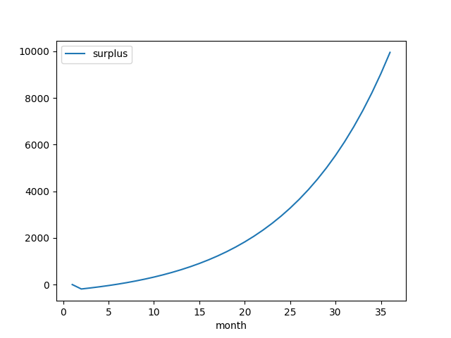

# Savvy Business Model Optimization

- https://idm-savvy.github.io/business-model-optimization/result-20240505-163334.html
- https://idm-savvy.github.io/business-model-optimization/regression.html
- https://idm-savvy.github.io/business-model-optimization/break-even-month.html
- https://idm-savvy.github.io/business-model-optimization/profitable-in-12-months.html

## An example configuration

- searched 3.1m permutations
- performed regression on each, selected slopes above 0
- found 29.6k profitable parameter sets



```python
{
    "starting_deposits": 1_000_000,
    "growth_pct": 0.09,
    "average_user_yield": 0.15,
    "starting_pol": 0,
    "average_protocol_yield": 0.15,
    "protocol_fee_pct": 0.45,
    "buyback_rate_pct": 0.6,
    "lp_expected_apr": 0.08,
    "monthly_swap_pressure_pct": 1.0,
}
```

## Install

```bash
apt install -y make python3.12-venv
git clone https://github.com/idm-savvy/business-model-optimization.git
cd business-model-optimization
make init install sim
```

## Github Pages

- repo must be publicly visible
- Source: Deploy from a branch
- Branch: `main/docs`
